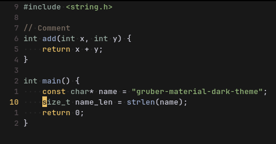

# Gruber Material Dark

Softer variants of the [Gruber Darker](https://github.com/rexim/gruber-darker-theme) theme.

Two variants are included: `gruber-material-dark` and `gruber-material-dark-intense`.

## Screenshots

#### Default


#### Intense *(closer to the original, but still softer)*


## Installation

### MELPA *(pending)*

``` lisp
(use-package gruber-material-dark
  :ensure t)
```
Then `M-x load-theme` and pick `gruber-material-dark` or `gruber-material-dark-intense`.

### Manual

Clone the repository into your Emacs themes directory:
```
git clone https://github.com/Vostranox/gruber-material-dark.git ~/.config/emacs/themes/gruber-material-dark
```
Add the directory to both `load-path` and `custom-theme-load-path`:
``` lisp
(add-to-list 'load-path (locate-user-emacs-file "themes/gruber-material-dark"))
(add-to-list 'custom-theme-load-path (locate-user-emacs-file "themes/gruber-material-dark"))
(load-theme 'gruber-material-dark t) ; or 'gruber-material-dark-intense
```
