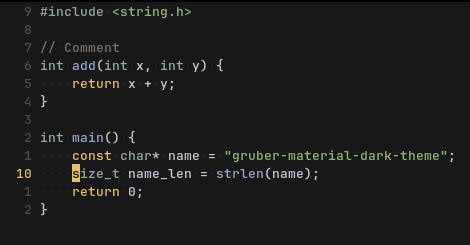

# Gruber Material Dark

Softer variants of the [Gruber Darker](https://github.com/rexim/gruber-darker-theme) theme.

Two variants are included: `gruber-material-dark` and `gruber-material-dark-intense`.

## Screenshots

#### Default


#### Intense *(closer to the original, but still softer)*


## Installation

With Emacs 30.1 or newer and Git installed, add this to your init file to install directly from GitHub using [`use-package :vc`](https://www.gnu.org/software/emacs/manual/html_node/use-package/Install-package.html):

``` lisp
(use-package gruber-material-dark
  :vc (:url "https://github.com/Vostranox/gruber-material-dark" :rev :newest)
  :demand t
  :config
  (unless (custom-theme-enabled-p 'gruber-material-dark-intense)
    (load-theme 'gruber-material-dark-intense :no-confirm)))
```
